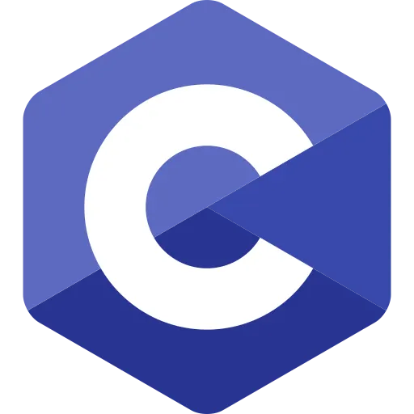
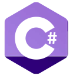
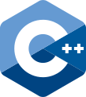
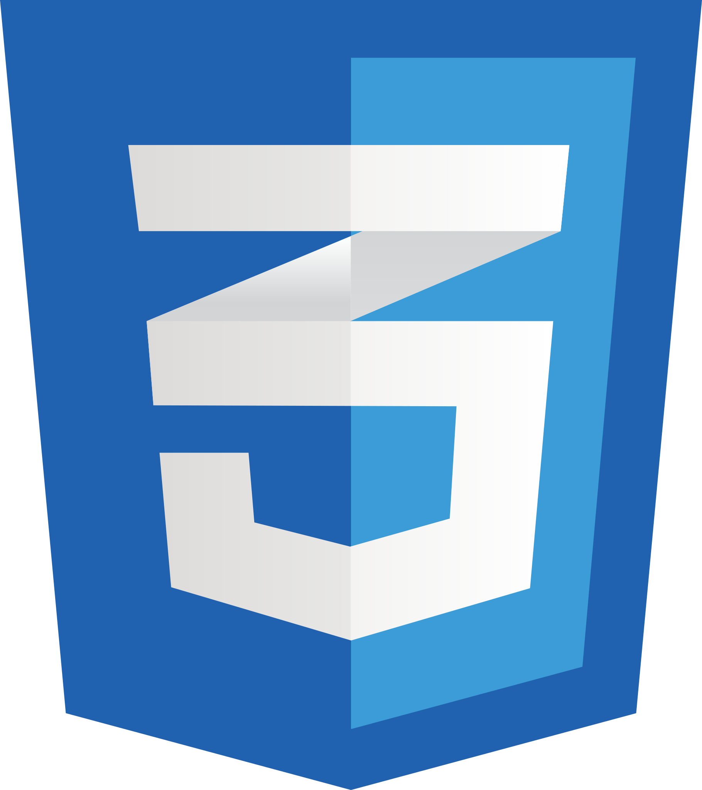
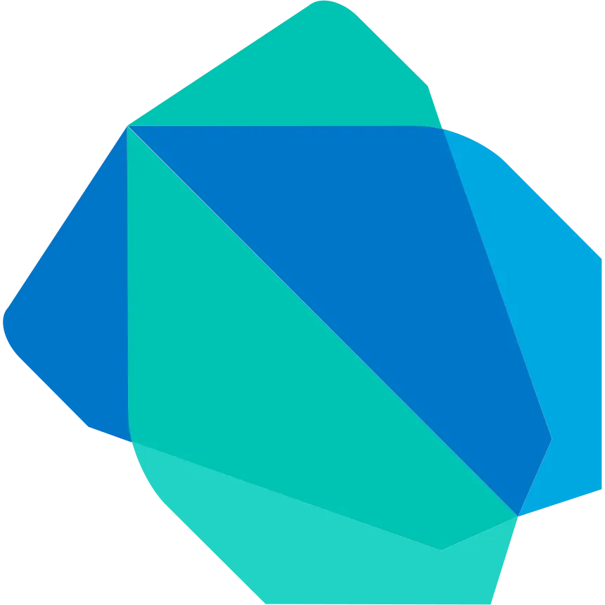
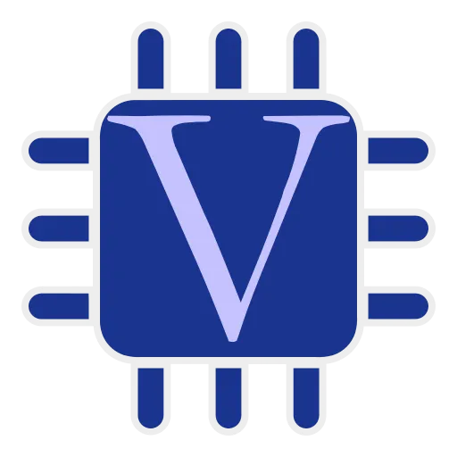
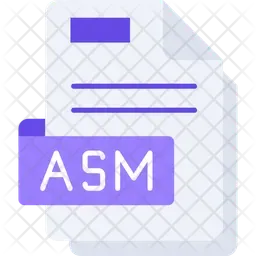

  <h1 align="center">Abdulrahman Hamed</h1>

  

  

    
    &nbsp;&nbsp;&nbsp;&nbsp;
    
    &nbsp;&nbsp;&nbsp;&nbsp;
    
  

  

## `01 / ABOUT ME`

I am a Computer and Network Engineer who builds practical projects across AI, machine learning, computer vision, robotics, embedded systems, brain-computer interfaces, FPGA design, IoT, web development, and autonomous systems.

I enjoy working across software and hardware, integrating AI into real systems, and turning ideas into functional prototypes through hands-on development.

I enjoy exploring the wider world of technology, learning across disciplines, and continuously expanding what I can build.

## `02 / SKILL SET`

**Languages**
     

 

 

AI & Computer Vision

  
  
  
  
  

Embedded Systems, Robotics & IoT

  
  
  
  
  
  
  
  

Development Tools

  
  
  
  
  

  

## `03 / FEATURED PROJECTS`

<table>
  <tr>
    <td width="50%" valign="top">
      <h3><a href="https://github.com/nictryx/ai-client-discovery-assistant">AI Client Discovery Assistant</a></h3>
      
Transforms potential-client project forms into structured discovery briefs for human review.

      <code>AI</code> <code>JavaScript</code> <code>Automation</code>
    </td>
    <td width="50%" valign="top">
      <h3><a href="https://github.com/nictryx/smart-campus-iot-monitoring">Smart Campus IoT Monitoring</a></h3>
      
ESP32-based monitoring with sensors, MQTT telemetry, dashboards, and automated rules.

      <code>ESP32</code> <code>C++</code> <code>MQTT</code>
    </td>
  </tr>
  <tr>
    <td width="50%" valign="top">
      <h3><a href="https://github.com/nictryx/rosmaster-r2-robotics-project">ROSMASTER R2 Autonomous Perception</a></h3>
      
Combines LiDAR, YOLOv5, object tracking, wall following, and autonomous movement.

      <code>Python</code> <code>YOLOv5</code> <code>LiDAR</code>
    </td>
    <td width="50%" valign="top">
      <h3><a href="https://github.com/nictryx/voip-telegram-ai-chatbot">Telegram AI Chatbot</a></h3>
      
Groq-powered Telegram chatbot supporting text-to-text and voice-to-voice conversations.

      <code>Python</code> <code>Groq</code> <code>Telegram</code>
    </td>
  </tr>
  <tr>
    <td width="50%" valign="top">
      <h3><a href="https://github.com/nictryx/verilog-8x8-array-multiplier">Verilog 8×8 Array Multiplier</a></h3>
      
Structural arithmetic unit that calculates Z = ¼(A × B) and runs on a Nexys 4 DDR FPGA.

      <code>Verilog</code> <code>FPGA</code> <code>Vivado</code>
    </td>
    <td width="50%" valign="top">
      <h3><a href="https://github.com/nictryx/dragon12-smart-room-automation">Dragon12 Smart Room Automation</a></h3>
      
Embedded smart-room prototype with sensing, access control, alerts, and actuator automation.

      <code>Embedded C</code> <code>MC9S12</code> <code>Sensors</code>
    </td>
  </tr>
</table>

## `04 / GITHUB ACTIVITY`

  

    
    
  

  

  <h3>Let's build something useful.</h3>

<a href="mailto:abdulrahman2002hamed@gmail.com">Email</a> •
<a href="https://www.linkedin.com/in/abdulrahman-hamed-103841362/">LinkedIn</a> •
<a href="https://github.com/nictryx">GitHub</a>

